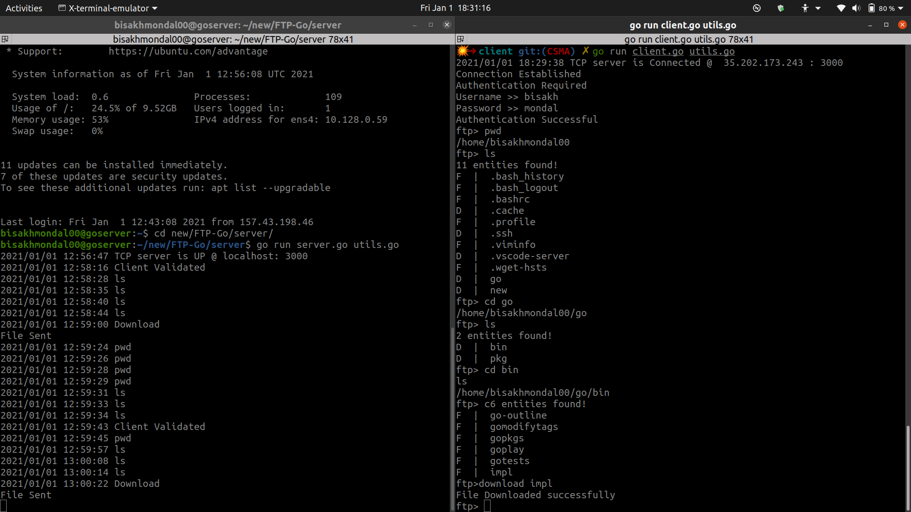

## FTP CLIENT-SERVER implementation in GoLang
A File Transfer Protocol(FTP) **Multi Client** implementation in go environment with client authentication.

### Supported Commands
- **pwd** [print working directory]
- **ls** [list directory]
- **cd** [change directory]
- **upload** [upload file from current "filestore/clientDir"]
- **download** [download file from $(pwd) of the ftp client terminal]
-  **delete** [delete specific file from the current pwd]
-  **close/exit** [close the connection]


### Directory Structure
- [x] client : Contains implementation of the client.
- [x] server : server side code in the FTP

```bash
cd server 
go run server.go utils.go
#Multiple clients can be attached 
cd ../client
go run client.go utils.go
```

#### Add credentials real time @ `server/credential.json` before attaching a new ftp client to the server.
***


#### A screenshot of local client connected to the server running on GCP cloud VM.
Run the `server` in cloud VM and put the ip of the instance in `client/client.go`'s `HOST` parameter.
  


!make sure to allow traffic to the port specified on your VPC firewall.

easy-peasy right!

~Bisakh.
